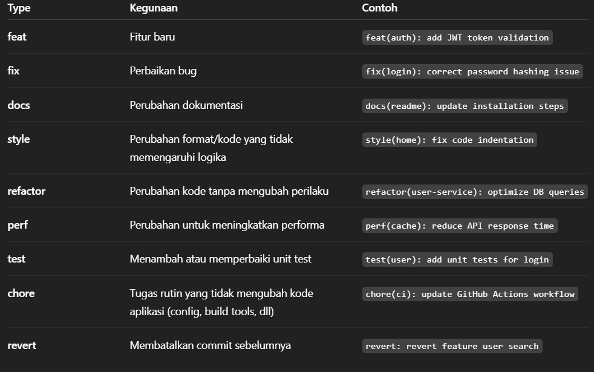

# PULL REQUEST TEMPLATE

## BRANCHING

- Master : Branch utama yang digunakan untuk staging & Production

Setiap branch mewakili 1 modul / fitur
Penamaan branch fitur seperti berikut:
feature/(nama modul)

## Pesan Commit

type(scope): pesan singkat

### Contoh:

docs(readme.md): update dokumentasi

- [opsional: deskripsi lengkap]
- [opsional: referensi issue atau task]

🛠 Daftar Type Commit:

